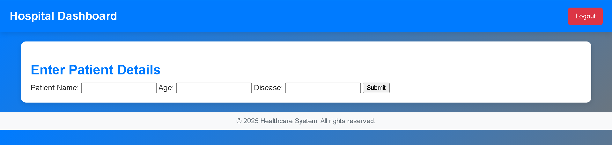

# Hospital Management System

A web-based hospital management system built with PHP and MySQL, designed to manage hospital and patient data efficiently. The system includes an admin dashboard, hospital dashboard, and data visualization features.

---

## Features

### Admin Dashboard
- View and manage hospitals.
- Add new hospitals to the system.
- Access system-wide statistics.
- Monitor patient data across all hospitals.
- Visualize data using:
  - Time-Series Graph (Patients admitted over time).
  - Pie Chart (Disease distribution).
  - Bar Graph (Patients per hospital).

### Hospital Dashboard
- Manage patient records.
- Add new patients to the system.
- View patient statistics.

### Patient Management
- Track patient details including name, age, and disease.
- Record date of entry.
- Associate patients with specific hospitals.

---

## Database Structure

### Tables

1. **admin**
   - `id` (INT, Primary Key, Auto Increment)
   - `username` (VARCHAR(255), Unique)
   - `password` (VARCHAR(255))

2. **hospitals**
   - `id` (INT, Primary Key, Auto Increment)
   - `name` (VARCHAR(255))
   - `username` (VARCHAR(255), Unique)
   - `password` (VARCHAR(255))

3. **patients**
   - `id` (INT, Primary Key, Auto Increment)
   - `hospital_id` (INT, Foreign Key)
   - `name` (VARCHAR(255))
   - `age` (INT)
   - `disease` (VARCHAR(255))
   - `date_of_entry` (TIMESTAMP)

---

## Setup Instructions

### Prerequisites
- XAMPP (Apache, MySQL, PHP)
- Web browser

### Installation
1. Clone or download this repository to your XAMPP's `htdocs` folder.
2. Start Apache and MySQL services in XAMPP.
3. Import the database schema into MySQL (if not already created).
4. Access the application through your web browser at `http://localhost/wt_proj2`.

### Configuration
- Update database credentials in `db.php` if needed.
- Default database name: `db1`.

---

## Usage

### Login
- Access the login page at `login.html`.
- Use admin or hospital credentials to log in.

### Admin Access
- View and manage all hospitals.
- Add new hospitals using the "Add New Hospital" button.
- Access system-wide statistics and data visualizations.

### Hospital Access
- Manage patient records.
- Add new patients using the hospital dashboard.
- View patient statistics.

---

## Technology Used

- **Frontend**: HTML, CSS (with responsive design), JavaScript (Chart.js for data visualization).
- **Backend**: PHP (session management, database interaction).
- **Database**: MySQL (relational database for storing hospital and patient data).

---

## Screenshots

### Login Page

### Admin Dashboard
S

### Add Hospital Page

### Hospital Dashboard

---

## Security Features

- Password protection for both admin and hospital accounts.
- Session management to restrict unauthorized access.
- Secure logout functionality.

---

## File Structure

- `login.html` - Login page.
- `login.php` - Login authentication.
- `admin_dashboard.php` - Admin interface.
- `hospital_dashboard.php` - Hospital interface.
- `add_hospital.php` - Add new hospitals to the system.
- `fetch_chart_data.php` - Data visualization support.
- `db.php` - Database connection.
- `logout.php` - Session termination.
- `assets/` - Contains CSS, JavaScript, and other static files.
  - `css/style.css` - Styling for the application.
  - `js/chart.js` - Chart.js integration for graphs.

---

## Support

For any issues or questions, please contact the system administrator.

---

## References

- [PHP Documentation](https://www.php.net/docs.php)
- [MySQL Documentation](https://dev.mysql.com/doc/)
- [Chart.js Documentation](https://www.chartjs.org/docs/)
- [XAMPP Documentation](https://www.apachefriends.org/index.html)